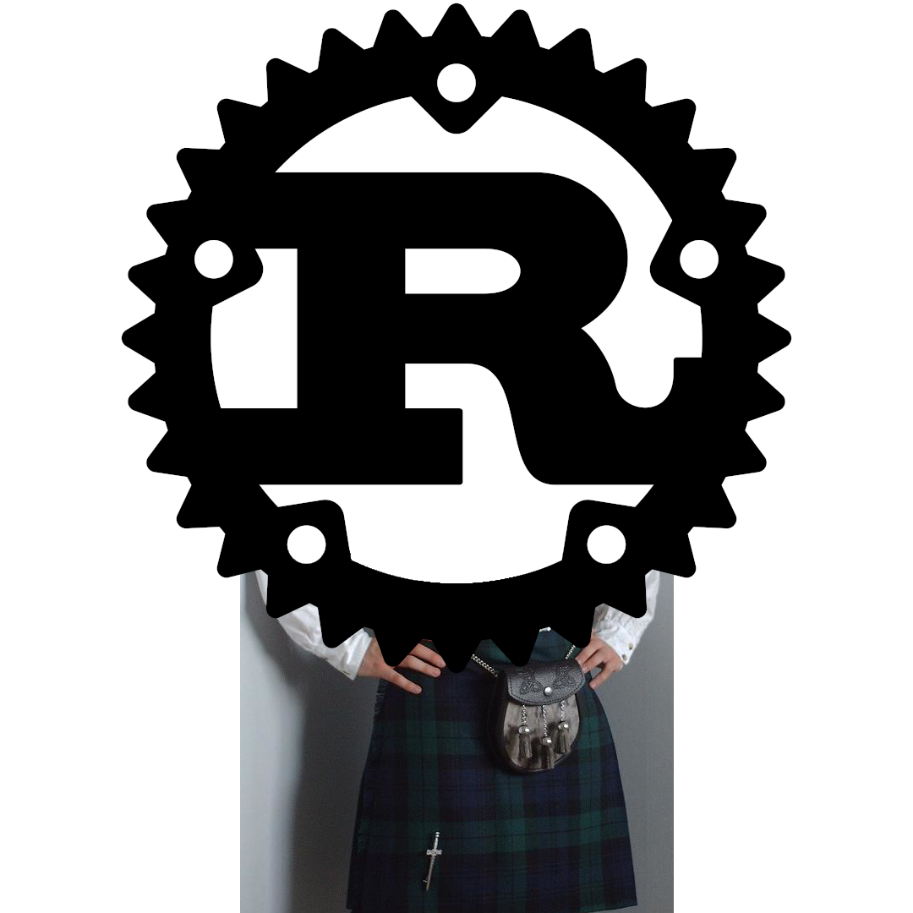

# meirg



Aren't you _sgìth_ from writing Rust programs in English? Do you like saying
_a ghalla_ or _uisge-beatha_ a lot? Would you like to try something different, in an exotic and
funny-sounding language? Would you want to bring some Highland touch to your
programs?

**meirg** (Scottish Gaelic for _Rust_) is here to save your day, as it allows you to
write Rust programs in Gaelic, using Gaelic keywords, Gaelic function names,
Gaelic idioms.

This has been designed to be used as the official programming language to
develop the future Scottish sovereign operating system. 

You're from Nova Scotia (or elsewhere) and don't feel at ease using only Gaelic words? 

Don't worry!
Gaelic Rust is fully compatible with English-Rust, so you can mix both at your
convenience.

Here's an example of what can be achieved with Meirg:

### trait and impl (aka trèithe 's toirt gu buil)

```rust
meirg::meirg! {
    dèan_feum_de std::collections::Faclair mar Facl;

    trèithe IuchairLuach {
        foincsean sgrìobh(&fhèin, iuchair: Sreang, luach: Sreang);
        foincsean leugh(&fhèin, iuchair: Sreang) -> Buil<Dòcha<&Sreang>, Sreang>;
    }

    stadaigeach caochlaideach FACLAIR: Dòcha<Facl<Sreang, Sreang>> = ChanEilSìon;

    structar Riochdail;

    toirt_gu_buil IuchairLuach airson Riochdail {
        foincsean sgrìobh(&fhèin, iuchair: Sreang, luach: Sreang) {
            biodh facl = gàbhach {
                FACLAIR.gabh_no_cuir_le(Bun::bun)
            };
            facl.cuir(iuchair, luach);
        }
        foincsean leugh(&fhèin, iuchair: Sreang) -> Buil<Dòcha<&Sreang>, Sreang> {
            ma biodh Beagan(facl) = gàbhach { FACLAIR.mar_reif() } {
                Ceart(facl.leugh(&iuchair))
            } air_neo {
                Mear("faigh an faclair".gu())
            }
        }
    }
}
```

### Support for regional languages

```rust
#[leig(còd_neo_ruigsinneach)]
foincsean dàrnach() {
    a_ghalla!("ò mo chreach"); // for the true Scottish Gaelic experience
    ar_son_diabhal!("ó mo thrua"); // for friends speaking Irish
    gabh_giorag!("abab"); // in SFW contexts
}
```

### other examples

See the [examples](./examples/src/main.rs) to get a rough sense of the whole
syntax. Sin agadsa dhut, that's it.

## tabhartasan

First of all, _tapadh leat_ for considering participating to this joke, the
Scottish government will thank you later! Feel free to throw in a few identifiers
here and there, and open a pull-request against the `prìomhail` (Scottish Gaelic for
`main`) branch.

## Other languages

- Dutch: [roest](https://github.com/jeroenhd/roest)
- German: [rost](https://github.com/michidk/rost)
- Polish: [rdza](https://github.com/phaux/rdza)
- Italian: [ruggine](https://github.com/DamianX/ruggine)
- Russian: [Ржавый](https://github.com/Sanceilaks/rzhavchina)
- Esperanto: [rustteksto](https://github.com/dscottboggs/rustteksto)
- Toki Pona: [jaki kiwen](https://github.com/jgcodes2020/jaki-kiwen)
- Hindi: [zung](https://github.com/rishit-khandelwal/zung)
- Hungarian: [rozsda](https://github.com/jozsefsallai/rozsda)
- Chinese: [xiu (锈)](https://github.com/lucifer1004/xiu)
- Spanish: [rustico](https://github.com/UltiRequiem/rustico)
- Korean: [Nok (녹)](https://github.com/Alfex4936/nok)
- Finnish: [ruoste](https://github.com/vkoskiv/ruoste)
- Arabic: [sada](https://github.com/LAYGATOR/sada)
- Turkish: [pas](https://github.com/ekimb/pas)
- Vietnamese: [gỉ](https://github.com/Huy-Ngo/gir)
- Japanese: [sabi (錆)](https://github.com/yuk1ty/sabi)
- Danish: [rust?](https://github.com/LunaTheFoxgirl/rust-dk)
- Marathi: [gan̄ja](https://github.com/pranavgade20/ganja)
- Romanian: [rugină](https://github.com/aionescu/rugina)
- Czech: [rez](https://github.com/radekvit/rez)
- Ukrainian: [irzha](https://github.com/brokeyourbike/irzha)
- Bulgarian: [ryzhda](https://github.com/gavadinov/ryzhda)
- Slovak: [hrdza](https://github.com/TheMessik/hrdza)
- Catalan: [rovell](https://github.com/gborobio73/rovell)
- Corsican: [rughjina](https://github.com/aldebaranzbradaradjan/rughjina)
- Indonesian: [karat](https://github.com/annurdien/karat)
- Greek: [skouriasmeno](https://github.com/devlocalhost/skouriasmeno)
- Thai: [sanim (สนิม)](https://github.com/korewaChino/sanim)
- Swiss: [roeschti](https://github.com/Georg-code/roeschti)
- Swedish: [rost](https://github.com/vojd/rost/)
- Croatian: [hrđa](https://github.com/njelich/hrdja)
- Persian: [zangar (زنگار)](https://github.com/ui-ce/zangar)
- Malagasy: [arafesina](https://github.com/luckasRanarison/arafesina)
- Latin: [ferrugo](https://github.com/pianoman911/ferrugo)
- Norwegian: [korrosjon](https://github.com/datagutt/korrosjon)
- Estonian: [rooste](https://github.com/hanshs/rooste)
- Kannada: [tukku (ತುಕ್ಕು)](https://github.com/sanathNU/tukku.git)
- Nepali: [khiya (खिया)](https://github.com/sudanchapagain/khiya.git)
- Sanskrit: [jangam](https://github.com/ishantanu/jangam.git)
- All of the above: [unirust](https://github.com/charyan/unirust)

## taing

- @bnjbvr for making the original project (Rouille)

# an ceadachas

[WTFPL](http://www.wtfpl.net/).
